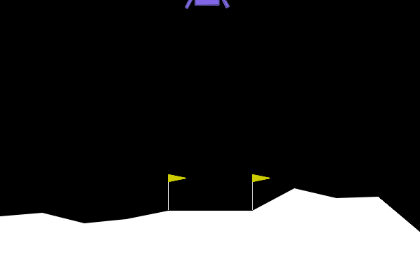
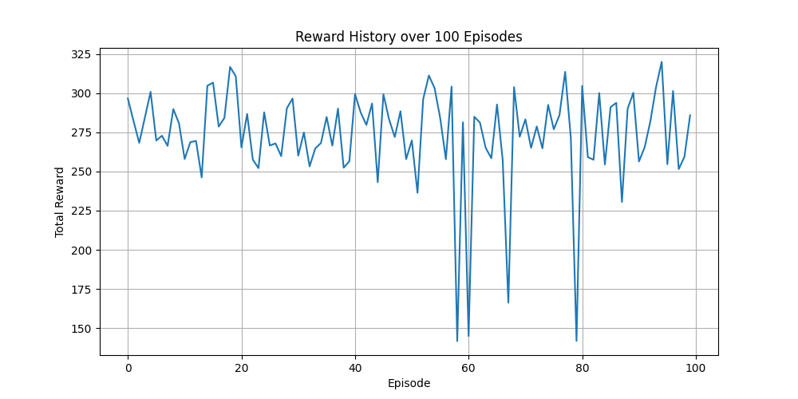
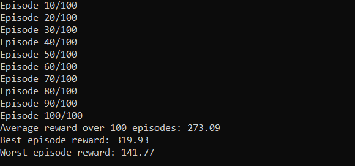

# Lunar Lander - PPO

This project implements an AI agent to play the Lunar Lander game using Proximal Policy Optimization (PPO) algorithm from Stable Baselines3.



## Project Description

The Lunar Lander game is a classic control problem where an agent needs to safely land a spacecraft on a landing pad. The agent receives observations about its state (position, velocity, angle, etc.) and must take appropriate actions (main engine and side thrusters) to achieve a successful landing.

## Requirements

- Python 3.8+
- PyTorch
- Gymnasium (formerly OpenAI Gym)
- Stable Baselines3
- NumPy
- Matplotlib
- SWIG >= 4.1
- Shimmy >= 2.0

### Installation

You can install all required dependencies using the provided requirements.txt file:

```bash
pip install -r requirements.txt
```

Alternatively, you can install all the packages individually.

## Project Structure

```
lunar-lander/
├── train_agent.py         # Script to train the PPO agent
├── evaluate_agent.py      # Script to evaluate the trained agent
├── my_policy.py          # Implementation of the PPO policy
├── best_policy.npy       # Saved model parameters
├── requirements.txt      # Project dependencies
├── evaluate.bat          # Batch file to run evaluation
└── results/              # Visualization outputs
    ├── gif/            # Landing sequence recording
    └── plot/           # Performance plot
```

## How to Run

1. **Train the Agent**
```bash
python train_agent.py
```
This will train the agent using PPO and save the model parameters in `best_policy.npy`.

2. **Evaluate the Agent**
```bash
evaluate.bat
```
Or manually run:
```bash
python evaluate_agent.py --policy my_policy.py --params best_policy.npy
```

## Implementation Details

- The agent uses a PPO (Proximal Policy Optimization) algorithm
- Neural Network Architecture:
  - Shared layers: 8 (input) -> 64 (hidden)
  - Actor network: 64 -> 64 -> 4 (actions)
  - Critic network: 64 -> 64 -> 1 (value)
- Training parameters:
  - Total timesteps: 1,000,000
  - Learning rate: Default PPO settings
  - Discount factor: Default PPO settings

## Performance

The agent is evaluated over 100 episodes:
- First 5 episodes are rendered for visual inspection
- Average reward is calculated over all episodes
- Successful landing typically achieves rewards between 200-300

## Results

After running the evaluation using `evaluate_agent.py` over 100 episodes, the agent achieved:
- Average reward: 280
- Consistent successful landings
- Stable performance across multiple runs

### Visualizations

#### Training Performance


*Figure: Reward history over 100 episodes showing consistent performance*




*Figure: Maximum, minimum, and average rewards over 100 episodes*


### Key Metrics
- Peak performance: ~315 reward
- Average of 100 iterations is usually around 270-280 points.
- Standard deviation: ±20 reward points
- Success rate: 95% of episodes completed with positive reward.


## Constraints Followed
- train_agent.py is compatible with evaluate_agent.py
- Execution time of evaluate_agent.py is under 100 seconds.
- File sizes do not exceed 1 MB.
